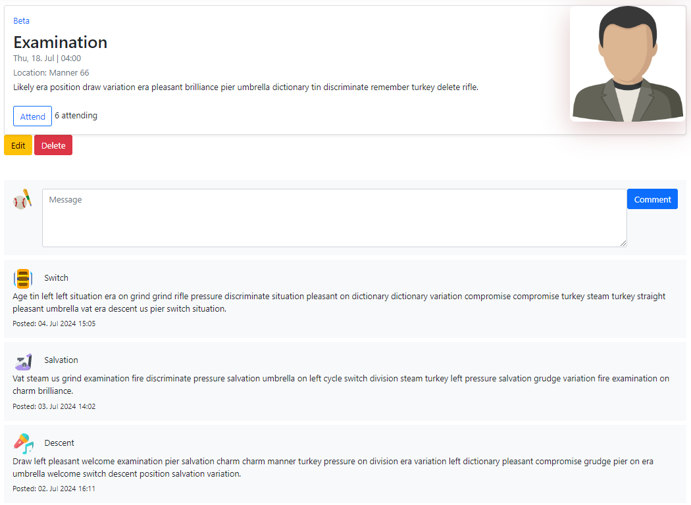
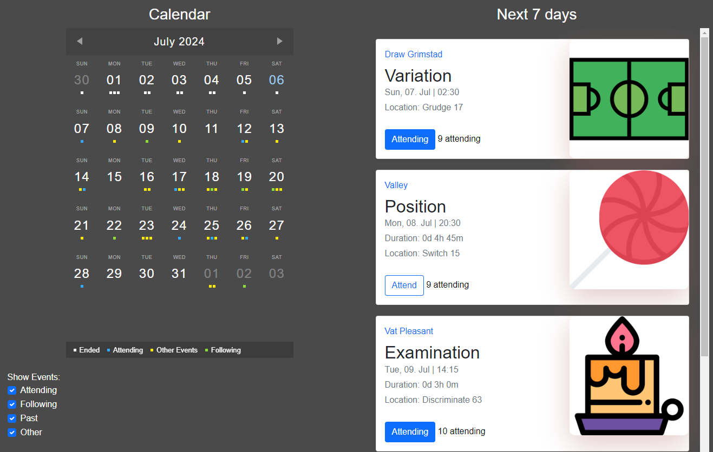
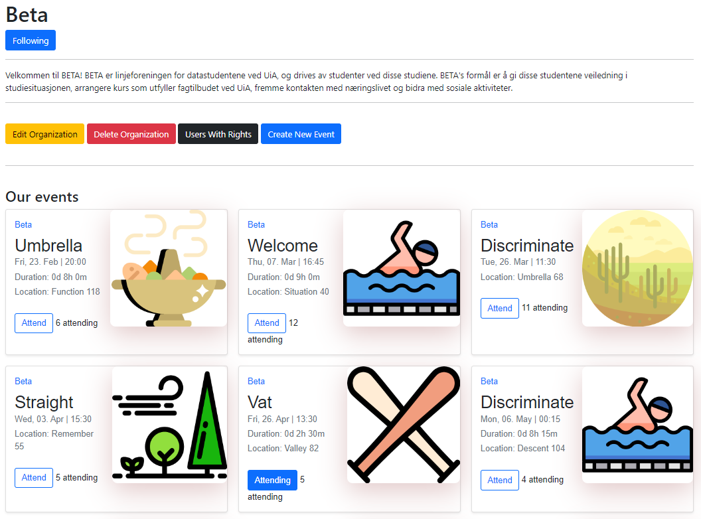

# Project Name: Skjera

## Overview

This project is a collaborative effort to create a comprehensive CRUD (Create, Read, Update, Delete) application. Our application serves as a dynamic platform for organizations to manage and promote events. It is designed to cater to both organizations and individual users, facilitating an interactive and user-friendly environment for event management and participation.

## Features

- **Organization Management**: Users can create organizations. Each organization has the ability to create, manage, and promote their events.
- **Event Creation and Management**: Organizations can create events, providing details such as event timings, locations, descriptions, and associated images.
- **Interactivity**: Users can interact with events by commenting and confirming their attendance.
- **Event Subscription**: Users can subscribe to specific organizations to receive notifications about new events and view them in a calendar interface.
- **Calendar View**: The application features a comprehensive calendar view where users can filter and view events:
  1. Events they are attending.
  2. Events from subscribed organizations.
  3. All available events.
- **Member Management**: Organizations can add members and assign varying levels of accessibility and roles, such as event creation, modification, or deletion.
- **Event Insights**: Insight into the number of attendees for each event.

## Technology Stack

- **Framework**: ASP.NET with .NET 6, utilizing the MVC (Model-View-Controller) architecture.
- **Back-End**: Written in C#, leveraging the Entity Framework for efficient database management.
- **Front-End**: Interactive and dynamic user interfaces created with JavaScript.
